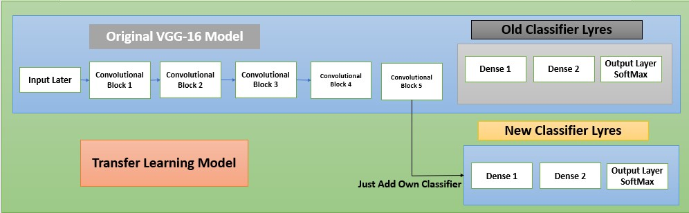
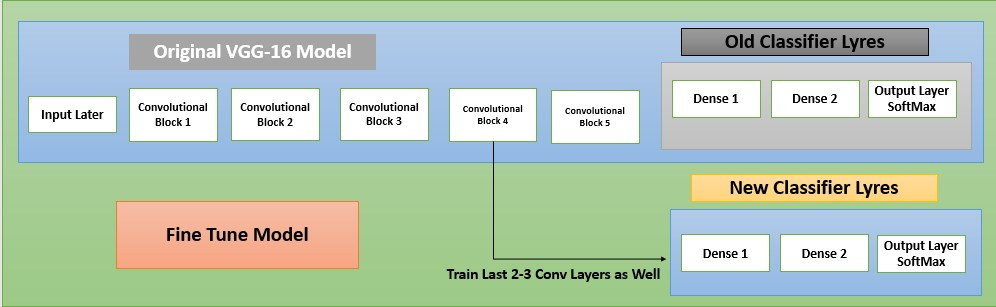
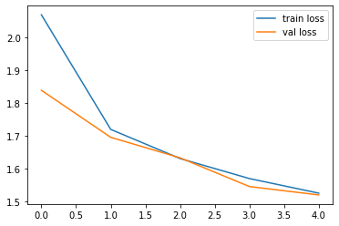
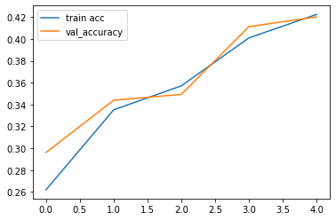
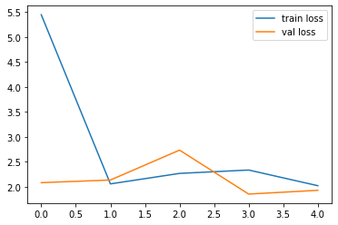
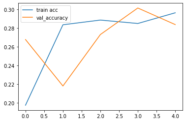
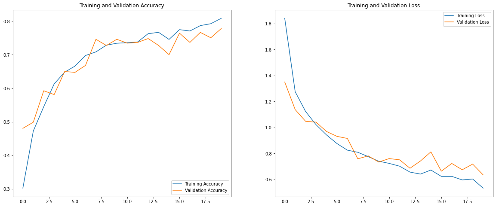
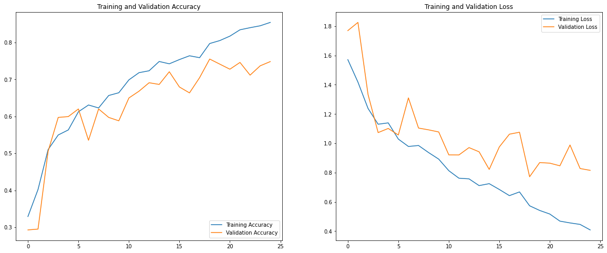

# Problem Statement
## Overview
This project focuses on the development and deployment of a Convolutional Neural Network (CNN) model designed to automate the segregation of waste materials. The goal is to facilitate efficient recycling by accurately classifying different types of waste materials. This model which help us to classify waste with 7 different waste materials and it will show you the details of that particular waste materials. This will help to raise awareness for people to reduce and recycle waste.

## Overview
- There are 'cardboard', 'compost', 'glass', 'metal', 'paper', 'plastic', 'trash' total 7 different types of waste materials which are use for recycling.
- Here i have 2187 images belonging 7 classes.
- Here i have trained dataset using VGG16,RESNET50 model via using Transfer Learning technique of CNN for classification.
- Here i have trained this model till 5 epochs and i got 41.31% accuracy on training data and 43% on testing data. Since my computer can not aford more epochs at this time due unavailbility of GPU. if you have good ammount of gpu you can train more than 50 epochs if you want to improve ac curacy.

---
## Introduction of Tranfer Learning and Fine Tuning
<p align = 'center'>
  
</p>

---
<p align = 'center'>
  
</p>

---
## VGG16 Architeture using Tranfer Learning
### Loss Plot of VGG16
<p align = 'center'>
  
</p>

### Accuracies Plot of VGG16
<p align = 'center'>
  
</p>

---
## ResNet50 Architeture using Tranfer Learning
### Loss Plot of ResNet50
<p align = 'center'>
  
</p>


### Accuracies Plot of ResNet50
<p align = 'center'>
  
</p>

---

## Improve VGG-16 using Tranfer Learning
### Loss and Acuuracy Plot of VGG-16 with TF
<p align = 'center'>
  
</p>

## Improve VGG-16 using Fine Tuning
### Loss and Acuuracy Plot of VGG-16 with FT
<p align = 'center'>
  
</p>

---

## Evaluation Matrix of VGG16 and ResNet50 Model

| Model Name       |Test Accuracy | Epochs | For improve accuracy |
| ---------------- | ------------- | ------ | -------------------- |
| VGG-16 with TL    |     43.03%    |   5    |    Set 100 Epochs    |
| ResNet-50 with TL |     29.78%    |   5    |    Set 100 Epochs    |
| Improvement of VGG-16 with TL |     72.5%    |   20    |    Tune more HT    |
| Improvement of VGG-16 with TL+FT |     80.8%    |   25    |    Tune more HT    |

# Waste Material Segregation Using CNN - README


## Table of Contents
1. [Introduction](#introduction)
2. [Project Structure](#project-structure)
3. [Requirements](#requirements)
4. [Data Preparation](#data-preparation)
5. [Model Architecture](#model-architecture)
6. [Training](#training)
7. [Evaluation](#evaluation)
8. [Deployment](#deployment)
9. [Usage](#usage)
10. [Contributing](#contributing)
11. [License](#license)

## Introduction
Proper waste segregation is critical for effective recycling processes. This CNN model is designed to classify waste into categories such as plastic, metal, paper, glass, and organic materials. The model helps in automating the sorting process, thereby enhancing efficiency and accuracy in recycling centers.

## Project Structure
```
waste-segregation-cnn/
├── data/
│   ├── raw/
│   ├── processed/
├── models/
├── notebooks/
├── src/
│   ├── data_preprocessing.py
│   ├── model.py
│   ├── train.py
│   ├── evaluate.py
│   └── predict.py
├── scripts/
├── README.md
├── requirements.txt
└── setup.py
```

## Requirements
To set up the project, ensure you have the following dependencies installed:
- Python 3.8+
- TensorFlow 2.x
- NumPy
- Pandas
- scikit-learn
- Matplotlib

Install the dependencies using:
```bash
pip install -r requirements.txt
```

## Data Preparation
1. **Data Collection**: Collect images of various waste materials categorized into different classes.
2. **Data Organization**: Organize the images into respective folders under the `data/raw` directory.
3. **Data Preprocessing**: Run the `data_preprocessing.py` script to resize images, normalize pixel values, and split the data into training, validation, and test sets.

```bash
python src/data_preprocessing.py
```

## Model Architecture
The CNN model is built using TensorFlow/Keras. It consists of multiple convolutional layers, pooling layers, dropout layers, and dense layers to perform the classification task.

### Example Architecture
```python
model = tf.keras.models.Sequential([
    tf.keras.layers.Conv2D(32, (3, 3), activation='relu', input_shape=(img_height, img_width, 3)),
    tf.keras.layers.MaxPooling2D((2, 2)),
    tf.keras.layers.Conv2D(64, (3, 3), activation='relu'),
    tf.keras.layers.MaxPooling2D((2, 2)),
    tf.keras.layers.Conv2D(128, (3, 3), activation='relu'),
    tf.keras.layers.MaxPooling2D((2, 2)),
    tf.keras.layers.Flatten(),
    tf.keras.layers.Dense(128, activation='relu'),
    tf.keras.layers.Dropout(0.5),
    tf.keras.layers.Dense(num_classes, activation='softmax')
])
```

## Training
Train the model using the `train.py` script. This script handles loading the data, compiling the model, and training it.

```bash
python src/train.py
```

## Evaluation
Evaluate the trained model using the `evaluate.py` script to assess its performance on the test dataset.

```bash
python src/evaluate.py
```

## Deployment
To deploy the model, you can use various platforms such as TensorFlow Serving, Flask for web deployment, or convert the model for mobile deployment using TensorFlow Lite.

## Usage
Once the model is trained and deployed, use the `predict.py` script to classify new waste material images.

```bash
python src/predict.py --image_path path/to/image.jpg
```

## Contributing
We welcome contributions from the community. Please follow these steps to contribute:
1. Fork the repository.
2. Create a new branch for your feature or bug fix.
3. Commit your changes and push the branch to your fork.
4. Open a pull request with a detailed description of your changes.

## License
This project is licensed under the MIT License. See the LICENSE file for more details.